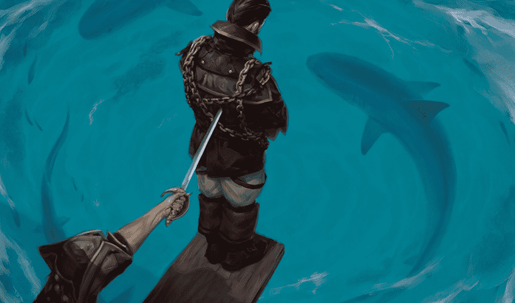

### Forensics/87kB Magic

Corrupted files are such a headache..

Author: SolvedPack#1949

flag : **csoc{C@n_y0U_wa1K_7H3_B1NArY?}**
#### Writeup

Using "pngcheck" on the png file gives "additional data after IEND chunk" which means there is some data appended to the png file. Now use "binwalk" which searches for file header and footer bytes (aka magic numbers) and outputs the list of files it found. The output it gives is:

DECIMAL  |     HEXADECIMAL |   DESCRIPTION
---------|-----------------|----------------------------------------------------
0        |    0x0          |  PNG image, 850 x 500, 8-bit colormap, non-interlaced
157      |    0x9D         |  Zlib compressed data, best compression
87211    |    0x154AB      |  End of Zip archive

(Ignore the Zlib line as that is the part of the png image compression)
This shows that it recognized the footer bytes of a zip file, which means there is a zip file appended to the png. Notice that the program didn't find the header bytes which means they are corrupted(or edited). 
Reading online about png file reveals that the png files end with "IEND" in ascii or "49 45 4e 44 ae 42 60 82" in hex. Also, in the start "pngcheck" said it found data after "IEND" chunk. So we just need to edit the bytes of plank.png (use any hex editor) and type in the correct zip header (50 4B 03 04) after the "IEND" bytes. After that use "binwalk -e plank.png" in the terminal and it should extract the zip file into a new directory. Open the directory, unzip the file and the flag will be in the .txt file.

(If you're having trouble finding the "IEND" bytes, start looking from the end of the file, or alternatively you can look for the address of the "Lolz" string which you have to replace with the zip header)

