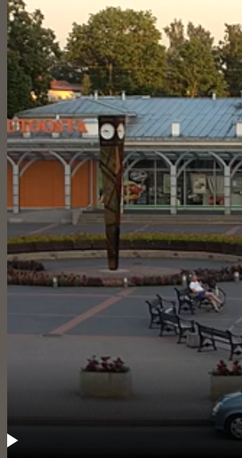

### misc/Meeting Place

who doesn't love chocolates?\
find the location in the given picture and wrap it in the flag format \
csoc{*} \
example: if the location was the Taj Mahal, then \
flag is csoc\{agra_taj_mahal_india}

flag : **csoc\{sigulda_railway_station_square_latvia}**