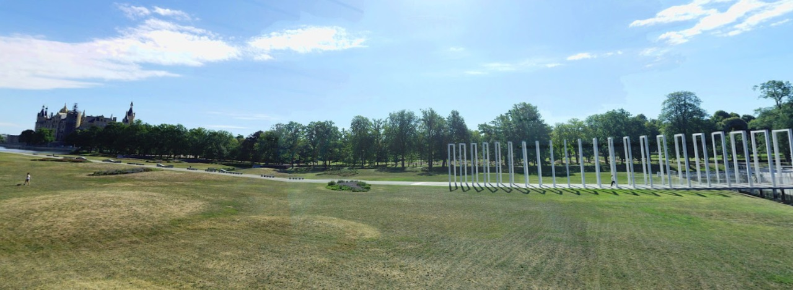

### misc/The Fugitive

A wanted fugitive was located in the 2 pictures given, can you pinpoint his location? \
input the flag as : \
csoc{name of mountain range visible in picture A, latitude of location B,longitude of location B}\
the longitudes and latitudes must be rounded off to 3 decimal digits.\
name of mountain seperated by _

flag : **csoc\{great_smoky_mountains,53.621,11.413}**